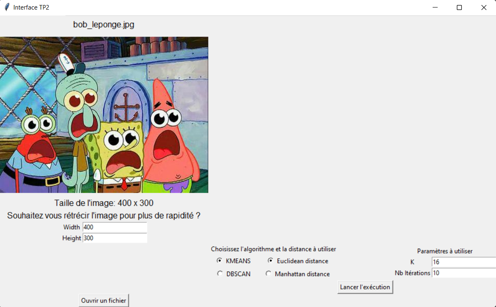
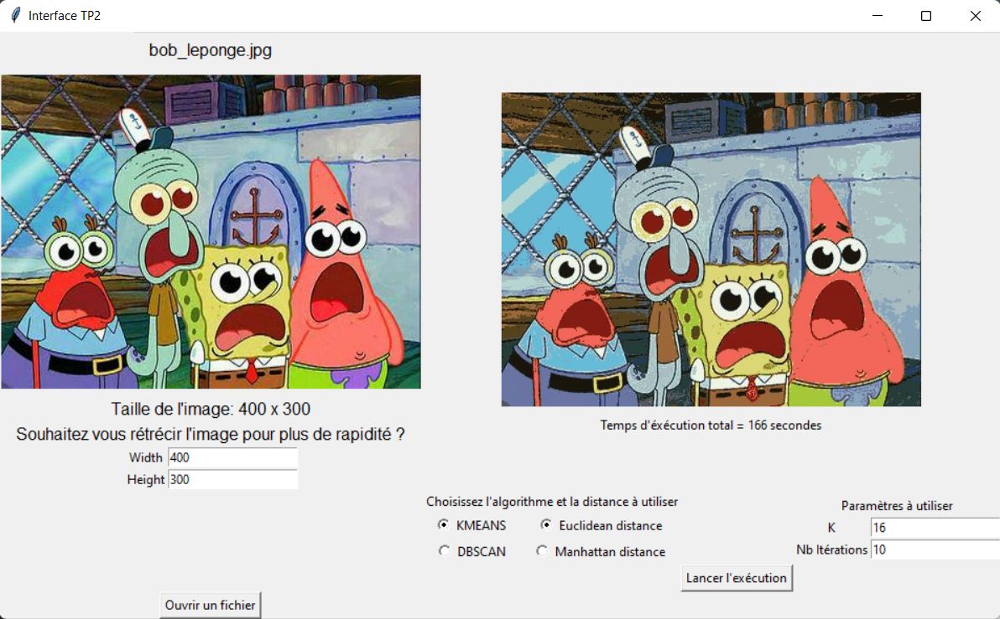

# 8INF954 - Forage de données : TP n°2 "Clustering de couleurs"

## Description
Ce TP a pour objectif d'implémenter les algorithmes K_Means et DBSCAN vu en cours et d'observer les différences entre les deux algorithmes sur différentes images.
Tester deux méthodes pour les calculs de distance.

## Exécution
- Dézipper le projet à l'emplacement de votre choix
- ####Deux possibilités:
  - 1 - 
      - Ouvrir le terminal windows
      - Se déplacer à la racine du projet 
      - Taper la commande suivante :
      .\venv\Scripts\python.exe .\viewer.py
  - 2-
      - Ouvrir le projet avec un IDE
      - Utiliser l'environnement virtuel fournit ou bien éxécuter pip intall -r requirements.txt
      La commande ci dessus va installer tous les packages nécessaire.
      - Pour finir vous pouvez éxécuter le fichier python : viewer.py
- Une petite fenêtre va s'ouvrir vous proposant de sélectionner un fichier
- Cliquer sur le bouton "Ouvrir un fichier", l'explorateur de fichier s'ouvre
- Choisissez l'image souhaité puis cliquer sur ouvrir.
- Vous arrivez maintenant sur l'interface graphique plus complète expliquée dans la partie suivante.

## Fonctionnement de l'interface

Voici à quoi ressemble l'interface graphique:
- Après l'ouverture d'une image, celle-ci apparait en haut à gauche
- D'autres informations sont disponibles comme son nom et ses dimensions.
- Il est également possible de réduire la taille de l'image si celle ci est imposante le processus peut être long (nottament DBSCAN).
- En bas à droite il est possible de modifier les paramètres à utiliser (type d'algorithme, distance, etc...)
- Si vous souhaitez changer d'image, cliquer sur "Ouvrir un fichier" en bas à gauche
- Pour lancer l'exécution il suffit ensuite d'appuyer sur Le bouton "Lancer l'exécution"

Si le programme s'est correctement lancé, le message processing... apparaitra sur l'interface et un message s'affichera dans la console. Au fur et à mesure quelques indications dans la console donneront l'avancée du programme
Maintenant il ne reste plus qu'à attendre, une fois que l'image aura été traitée, celle-ci sera à la fois rajouté au dossier output et à l'interface sur la partie droite.
On pourra alors également visualiser le temps d'exécution totale pour obtenir ce résultat.

## Visualisation des résultats:

Les tests que j’ai effectués sont enregistrés dans un dossier « output », ensuite pour chaque algorithme et chaque nom d'image traitée j’ai créé un sous dossier.

Le nom de l’image pour K-MEANS contient la valeur de k, le nombre d’itération et la distance utilisée : « 'res_k=' + valeur_k + '_iter=' + nombre_iterations + '_dist=' + type_distance + '__' + nom_image »

Le nom de l’image pour DBSCAN contient la valeur d’epsilon, le nombre minimum de points et la distance utilisée : « 'res_eps=' + valeur_epsilon + '_minPts=' + nombre_points + '_dist=' + type_distance + '__' + nom_image »

## Auteur
- Quentin Callens (CALQ06109900)

